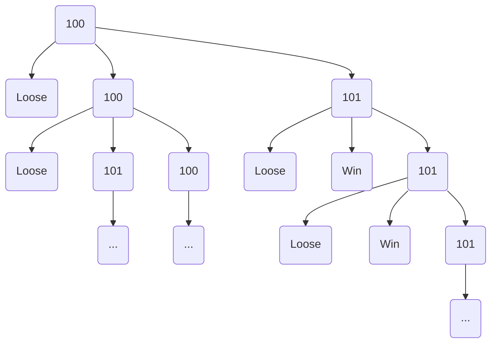

# Djeco Little Cooperation Probability Computer

Thus code has been designed to compute the probability to win 
on a board game made by Djeco and named "Little Cooperation"

This game is for 2 years old children, so the rules are very simple,
but the mathematics behind are not.

Here are these rules: 4 animals shall go from the start to an igloo.

To reach the igloo, they have to cross a bridge supported by 6 ice pillards.
Each player throw the 6 sides dice to get the action to do :

 * Remove an ice pillard (2 dice faces among the 6)
 * Move an animal from start to bridge if there is still an animal at start (2 dice faces among the 6)
 * Move an animal from the bridge to the igloo if there is an animal on the bridge (2 dice faces among the 6)

If no more ice pillards remains, every players loose.

If all animals reach the igloo, every players win.

The victory entirely depends on the dice, to the probability to win is defined by the rules of this game.

But what is this probability?

## Use a simplier game

To think about this problem, let's take a simplier version with only 1 animal and 1 ice pillard:

