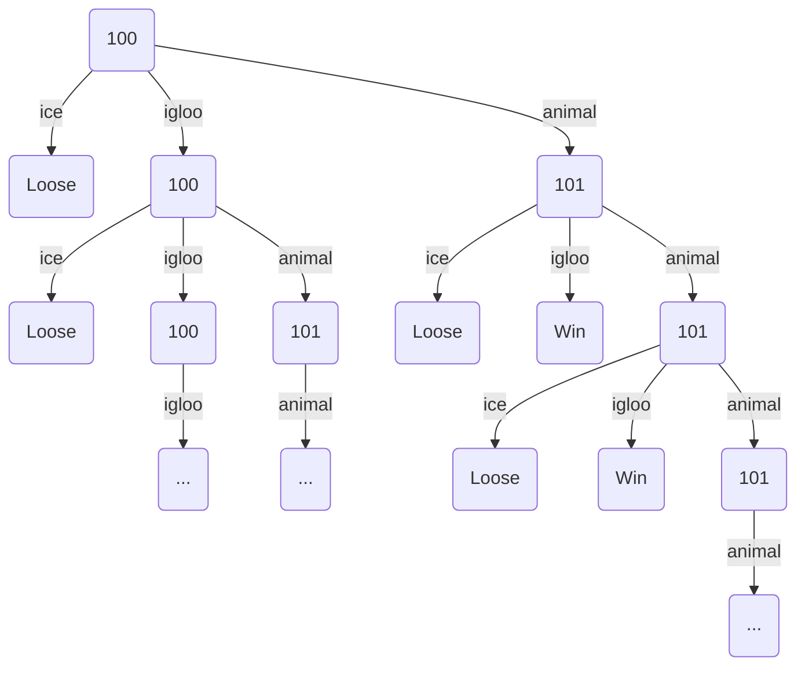
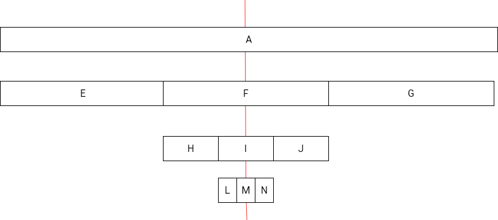

# Djeco Little Cooperation Game Infinite Tree Probability Computer

Thus code has been designed to compute the probability to win 
on a [board game made by Djeco](https://www.djeco.com/mobile/jeux.html) and named "Little Cooperation" :

This game is for 2 years old children, so the rules are very simple,
but the mathematics behind are not.

Here are these rules: 4 animals shall go from the start to an igloo.

To reach the igloo, they have to cross a bridge supported by 6 ice pillards.
Each player throw the 6 sides dice to get the action to do :

 * Remove an ice pillard (2 dice faces among the 6)
 * Move an animal from start to bridge if there is still animals at start (2 dice faces among the 6)
 * Move an animal from the bridge to the igloo if there are animals on the bridge (2 dice faces among the 6)

If no more ice pillards remains, every players loose.

If all animals reach the igloo, every players win.

The victory entirely depends on dice throws, so the probability to win is defined by the rules of this game.

But what is this probability?

## Naive approach

The probability to win is the ratio between the number of winning games with the number of all possible games.

A first naive approach is to use a recursive algorithm to go through all possible games 
and count how many there are and how many of them are winning games.

This method fails, because there are a infinity of games, 
due to the fact that some dice throws don't change the game's pieces state, 
but can be repeated without limit before leading to a winning or loosing game's end.

Nevertheless, winning or loosing immediately, or after some dice throws without effect
don't correspond to the same probability, each dice throw reducing the probability of the game's end by one third.

Therefore, counting the number of winning and loosing game end to compute the probability of win is impossible, 
because there is an infinite number of winning and loosing game's end.

## Use a simplier game

To think about this problem, let's take a simplier version of this game with only 1 animal and 1 ice pillard:

Here is a part of the infinite tree of all possible games with 1 animal and 1 ice pillard, 
the number representing the game state meaning:
Number of ice pillards, number of animals in Igloo, number of animals on Bridge:

We can see above that if we get igloo at the first dice throw, the game stays the same,
so the next dice throw have exactly the same possible outcomes.

As well, after a first 'animal' dice throw, 
a second 'animal' dice throw won't change the game state, 
so another infinite branch of game evolution span from here.

As with [Zeno's paradox](https://en.m.wikipedia.org/wiki/Zeno%27s_paradoxes), 
we may be disturbed by the sum of infinite probabilities, 
but this isn't incompatible with the finite value of this infinite number of probabilities.

### Zeno's paradox

In Zeno's paradox, Zeno goes from point A to point B by doing each time one half of the distance remaining from him to B.

Intuitively, we guess that Zeno will reach B after an infinite number of times, 
so the sum of values 1/2 + 1/4 + 1/8 + ... equals 1 after an infinite number of these values.

If we look at the probability to loose in the tree of above, not considering the 'igloo' at first dice throw,
we see :
 * Loose at 1/3rd probability
 * Loose at 1/3rd of 1/3rd probability (through 'Bridge' dice throw)
 * Loose at 1/3rd of 1/3rd of 1/3rd probability (through two 'Bridge' dice throws)
 * and so on

We get the same structure as Zeno's paradox, but with 1/3rd instead 1/2.

So what is the result of infinite sum : 1/3 + 1/9 + 1/27 + ... ?

We can guess it without computation:

On the diagram above, the red line represents the half of A.
A is splitted in three to keep its first third E.

After this, we add to this one third E its one third H, and afterwards L, the one third of H

As we can see on this diagram, each time the remaining space between the sum E, E+H and E+H+L, and the red line is half of the center third : F, I and M.

As the third are divided by 3 at each step, the sum gets three times closer to the red line.

We can check it by computation:

1/2 = 9/18

1/3 = 6/18

1/2 - 1/3 = 9/18 - 6/18 = 3/18

1/3 * 1/3 = 1/9 = 2/18

1/2 - 1/3 -  ( 1/3 * 1/3 ) = 9/18 - 6/18 - ( 2/18 ) = 1/18

The remaining to 1/2 is actually reduced by 3 when we add 1/3rd of the previous 1/3rd.

Thus, we guess that this infinite sum tends to 1/2 at infinite.

We can therefore compute the probabilities to loose and won in the infinite "101" branch of the tree above:

At each stage, this branch contains 1 win and 1 loose at 1/3rd regarding the node immediately above.

Therefore, at 101 game state, both winning and loosing probabilities correspond to the infinite series we just talked about : 1/3 + 1/9 + 1/27 ...

Because of this, from 101 game state, both winning and loosing probabilities is 1/2.

## Resolve and propagate probabilities

In the simplified game with 1 ice pillard and 1 animal, we just saw that we can compute thee probabilities of the infinite branch starting at 101 game state.

To compute the probabilities at game start, we need to compute the probabilities of 100 game state, which is the sum of loosing at 1/3rd and 2 infinite branches.

Fortunately, the probability of one of these infinite branches have just been computed.

Due to this, 100 game state starts a tree with:

 * Loose at 1/3rd (ice branch)
 * Unknown probabilities of infinite branch of 100 game state (igloo branch leading to same as the node immediately above)
 * Loose at 1/2 and win at 1/2 once on the 101 game state node itself at 1/3rd (bridge branch)

This configuration quite looks like the previous infinite branch we talked about, because we have only one infinite branch with same game state that the one of the node we are trying to compute probabilities.

Because of this, we can apply the same way of thinking:

The probabilities listed above repeat themselves infinitely with 1/3rd of them each time.

Therefore:

 * The ice branches bring to the 100 game state probabilities a loosing chance of 1/3rd + 1/9th + 1/27th +...
 * The bridge branch bring to the 100 game state probabilities of both winning and loosing of 1/3*1/2 + 1/3*1/2*1/3 + 1/3*1/2*1/3*1/3 + ...
 * The Igloo branch bring to the 100 game state the infinite repetition of the two other probabilities, but nothing more

