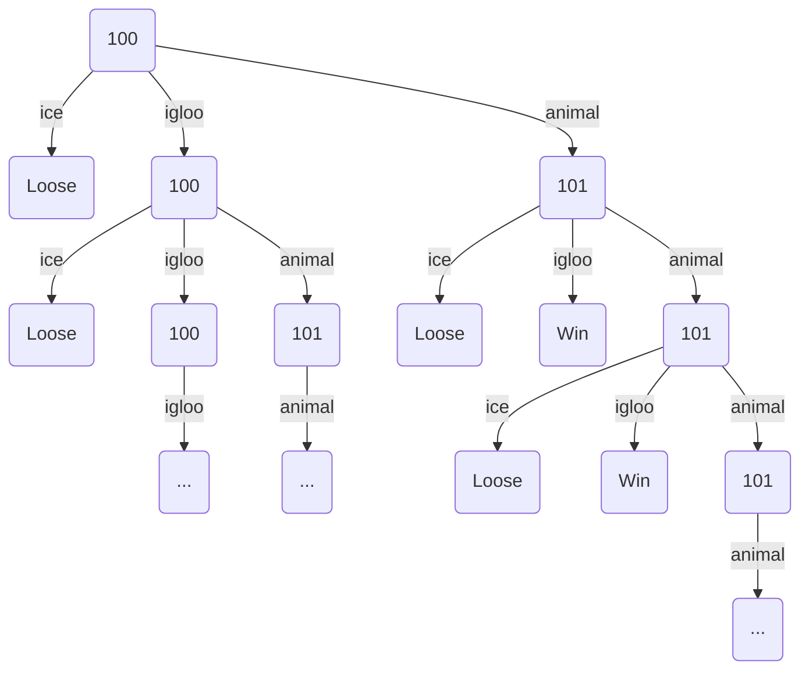

# Djeco Little Cooperation Probability Computer

Thus code has been designed to compute the probability to win 
on a board game made by Djeco and named "Little Cooperation"

This game is for 2 years old children, so the rules are very simple,
but the mathematics behind are not.

Here are these rules: 4 animals shall go from the start to an igloo.

To reach the igloo, they have to cross a bridge supported by 6 ice pillards.
Each player throw the 6 sides dice to get the action to do :

 * Remove an ice pillard (2 dice faces among the 6)
 * Move an animal from start to bridge if there is still an animal at start (2 dice faces among the 6)
 * Move an animal from the bridge to the igloo if there is an animal on the bridge (2 dice faces among the 6)

If no more ice pillards remains, every players loose.

If all animals reach the igloo, every players win.

The victory entirely depends on the dice, to the probability to win is defined by the rules of this game.

But what is this probability?

## Naive approach

The probability to win is the ratio between the number of winning games with the number of all possible games.

A first naive approach is to use a recursive algorithm to go through all possible games 
and count how many there are and how many of them are winning games.

This method fails, because there are a infinity of games, 
due to the fact that some dice throw don't change the game pieces state, 
but can be repeated without limit before leading to a winning of loosing game end.

Nevertheless, winning or loosing immediately or after some dice throws without effect
don't correspond to the same probability, each dice throw reducing the probability of the game end by one third.

## Use a simplier game

To think about this problem, let's take a simplier version of this game with only 1 animal and 1 ice pillard:

Here is a part of the infinite tree of all possible games with 1 animal and 1 ice pillard:

We can see above that if we get igloo at the first dice throw, the game stays the same,
so the next dice throw have exactly the same possible outcomes.

As well, aftter a first animal dice throw, 
a second a animal dice throw won't change the game state, 
so another infinite branch of game evolution span from here.
